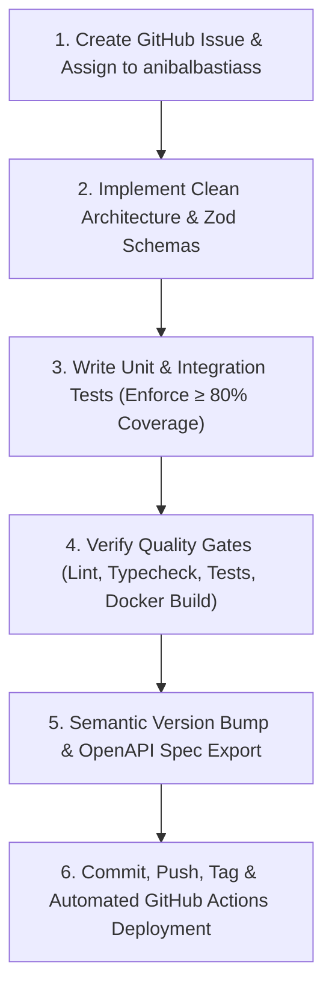

# ABS Smart Home Backend — Engineering Standards & Development Workflow

This skill defines the **mandatory engineering protocol** that AI agents and engineers MUST follow for every change in `abs-home-backend`.

---

## 🧭 Mandatory 6-Step Execution Protocol



---

## Step 1: 📋 GitHub Issue Creation & Assignment

1. **Create GitHub Issue**:
   ```bash
   gh issue create \
     --title "<type>(<scope>): <Descriptive title in Conventional Commits format>" \
     --body "### Summary
   <Description of the task>
   
   ### Architecture Scope
   - **Domains**: \`src/domains/<domain>\`, \`src/core/<area>\`
   - **Pattern**: Clean Architecture / BullMQ Worker / Kafka Event
   
   ### Deliverables
   - [ ] Implement core logic & Zod schemas
   - [ ] Unit & Integration Tests (≥ 80% coverage)
   - [ ] Export OpenAPI 3.1 Spec
   - [ ] Version bump & Release Notes" \
     --assignee "anibalbastiass" \
     --label "area:<area>" \
     --label "type:<type>"
   ```

---

## Step 2: 🏗️ Clean Architecture & Validation

- Handlers & Controllers: Pure request parsing and RFC 7807 responses.
- Services: Domain logic and transaction handling.
- Adapters: IoT vendor communication throttled by BullMQ sliding-window rate limiters.
- Events: Domain events published to Kafka topics.

---

## Step 3: 🧪 Test Coverage Gate (≥ 80%)

- Write tests with **Vitest** and **Supertest**.
- Enforce line coverage $\ge 80\%$:
  ```bash
  npm run test:coverage
  ```

---

## Step 4: 🔍 Quality Gates & Container Verification

```bash
npm run lint
npm run typecheck
npm run test
docker build -t abs-backend .
```

---

## Step 5: 📦 Version Bump & OpenAPI Export

- Bump `version` in `package.json`.
- Export OpenAPI spec:
  ```bash
  npm run spec:export
  ```

---

## Step 6: 🚀 GitHub Actions Automated Deployments

- Commit as `anibalbastias`:
  ```bash
  git add -A && git commit -m "feat(module): descriptive message (refs #<issue>)"
  git push origin main
  git tag -a vX.Y.Z -m "Release vX.Y.Z" && git push origin vX.Y.Z
  gh release create vX.Y.Z --title "vX.Y.Z" --notes "..."
  gh issue close <issue>
  ```
- **GitHub Actions** automatically deploys the release to DigitalOcean App Platform and syncs the KMP SDK.
