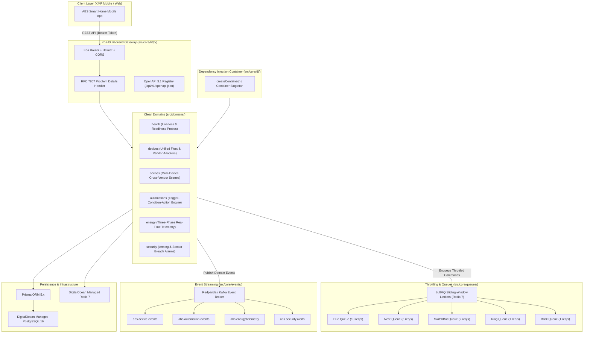

# ABS Smart Home — Backend Gateway & Control Plane

[](https://github.com/anibalbastiass/abs-home-backend/actions/workflows/ci.yml)
[](https://anibalbastiass.github.io/abs-home-backend/)
[](https://github.com/anibalbastiass/abs-home-backend/releases)
[](https://github.com/anibalbastiass/abs-home-backend)
[](https://www.typescriptlang.org/)
[](https://nodejs.org/)
[](https://koajs.com/)
[](https://www.postgresql.org/)
[](https://redis.io/)
[](https://redpanda.com/)
[](https://www.terraform.io/)
[](LICENSE)

High-performance, modular **KoaJS + TypeScript** IoT gateway and domain control plane for the **ABS Smart Home** ecosystem. Unifies third-party vendor clouds (**Philips Hue**, **Google Nest**, **SwitchBot**, **Ring**, **Amazon Blink**), three-phase power monitoring, and custom automation rules into a single zero-trust control plane.

---

## 🌐 Live Documentation & API Explorers

| Resource | Description | Live Link |
| :--- | :--- | :--- |
| 📚 **Docusaurus Documentation** | Complete architectural guides, domain specifications, and runbooks | [anibalbastiass.github.io/abs-home-backend](https://anibalbastiass.github.io/abs-home-backend/) |
| 📖 **Interactive Swagger UI** | Live browser-based OpenAPI explorer with schema testing | [anibalbastiass.github.io/abs-home-backend/swagger/](https://anibalbastiass.github.io/abs-home-backend/swagger/) |
| 📋 **OpenAPI 3.1 Specification** | Raw OpenAPI JSON spec for Kotlin Multiplatform mobile codegen | [anibalbastiass.github.io/abs-home-backend/openapi.json](https://anibalbastiass.github.io/abs-home-backend/openapi.json) |
| ⚡ **Local Swagger UI** | Local server interactive documentation | `http://localhost:3000/docs` |

---

## 🏛️ System Architecture



---

## ✨ Key Features

- **Clean Architecture & Isolated Domains**: Strict separation of concerns (`src/domains/{health, devices, scenes, automations, energy, security}`).
- **Dependency Injection**: Typed DI container (`src/core/di/container.ts`) using Service interfaces and `*Impl` classes.
- **BullMQ IoT Throttling**: Sliding window token bucket rate limiters per vendor to eliminate API 429 penalties.
- **Redpanda / Kafka Event Streaming**: Real-time domain event dispatching for telemetry, state updates, and alarms.
- **Three-Phase Energy Monitoring**: Sub-second telemetry ingestion for Phase A, B, and C with phase balance calculation.
- **RFC 7807 Problem Details**: Standardized HTTP API error responses.
- **OpenAPI 3.1 & KMP Synchronization**: Automated OpenAPI generation for Kotlin Multiplatform client SDKs.
- **Co-Located Test Strategy**: `*.spec.ts` (unit) and `*.ispec.ts` (integration) co-located next to production code with shared fixtures.
- **Terraform Infrastructure as Code**: Automated provisioning of DigitalOcean App Platform, PostgreSQL 16, and Redis 7.

---

## 📁 Repository Structure

```
abs-home-backend/
├── .agents/                   # AI Agent engineering standards and rules
├── .github/workflows/         # Automated GitHub Actions CI/CD pipelines
│   ├── ci.yml                 # Lint, typecheck, coverage gate (≥80%), docker test
│   ├── deploy-staging.yml     # Staging build, DOCR push, Terraform apply
│   └── deploy-production.yml  # Production release tag trigger
├── docs/                      # Generated OpenAPI 3.1 specification (openapi.json)
├── docs-site/                 # Docusaurus v3 documentation website
├── prisma/                    # PostgreSQL 16 schema and database seed script
│   ├── schema.prisma
│   └── seed.ts
├── scripts/                   # Utility and export scripts
│   └── export-openapi.ts      # OpenAPI 3.1 generator
├── src/
│   ├── config/                # Zod-validated environment config (env.ts)
│   ├── core/                  # Shared infrastructure and platform components
│   │   ├── database/          # Prisma database client singleton & lifecycle
│   │   ├── di/                # Dependency Injection Container (container.ts)
│   │   ├── errors/            # RFC 7807 Error hierarchy & middleware
│   │   ├── events/            # KafkaJS domain event producer & consumers
│   │   ├── http/              # Koa HTTP application factory & router mounting
│   │   ├── logger/            # Pino structured logging with correlation IDs
│   │   ├── openapi/           # Zod OpenAPI registry & builder
│   │   └── queues/            # BullMQ worker manager & rate limiters
│   ├── domains/               # Clean Architecture Domain Modules
│   │   ├── automations/       # Trigger-Condition-Action automation engine
│   │   ├── devices/           # Unified fleet manager & IoT vendor adapters
│   │   │   └── adapters/      # Hue, Nest, SwitchBot, Ring, Blink adapters
│   │   ├── energy/            # Three-phase power telemetry & phase balancing
│   │   ├── health/            # Liveness & readiness probes
│   │   ├── scenes/            # Cross-vendor scene orchestration
│   │   └── security/          # Security zone arming & alarm incidents
│   ├── test/                  # Shared testing utilities
│   │   └── fixtures/          # Centralized test fixtures & entity factories
│   └── server.ts              # Server bootstrap and graceful shutdown
├── terraform/                 # DigitalOcean Infrastructure as Code
│   ├── main.tf                # App Platform service spec
│   ├── database.tf            # Managed PostgreSQL & Redis clusters
│   ├── variables.tf           # Configurable variables & vendor secrets
│   └── outputs.tf             # Live URL & database endpoints
├── Dockerfile                 # Multi-stage production container build
├── docker-compose.yml         # Local stack (Postgres, Redis, Redpanda, Console)
├── eslint.config.mjs          # ESLint 9 configuration (4-spaces indentation)
├── package.json               # Dependencies, scripts, and engine specifications
├── tsconfig.json              # TypeScript configuration
└── vitest.config.ts           # Vitest runner with ≥80% coverage enforcement
```

---

## 🚀 Quick Start (Local Development)

### 1. Prerequisites
- **Node.js 22+ (LTS)**
- **Docker Desktop** (or Docker engine + Compose)
- **npm** (or pnpm)

### 2. Clone and Setup Environment
```bash
git clone https://github.com/anibalbastiass/abs-home-backend.git
cd abs-home-backend

# Copy environment template
cp .env.example .env

# Install dependencies
npm install
```

### 3. Launch Local Stack
Starts PostgreSQL 16, Redis 7, Redpanda (Kafka), and Redpanda Console on port `8085`:
```bash
npm run deploy:local
# or
docker compose up -d
```
> [!TIP]
> Inspect live Kafka events at **Redpanda Console**: [http://localhost:8085](http://localhost:8085)

### 4. Run Prisma Migrations & Seed Data
```bash
# Generate Prisma Client
npm run db:generate

# Run migrations & seed realistic smart home devices
npx prisma migrate dev
npm run db:seed
```

### 5. Start Backend Gateway
```bash
npm run dev
```
The server will start on `http://localhost:3000`:
- **Liveness Probe**: `GET http://localhost:3000/health/live`
- **Readiness Probe**: `GET http://localhost:3000/health/ready`
- **OpenAPI 3.1 Spec**: `GET http://localhost:3000/api/v1/openapi.json`

---

## 🧪 Testing & Quality Gates

This repository enforces an **80% line and branch coverage gate** on every pull request and build.

```bash
# Run all unit and integration tests
npm run test

# Run unit tests only (*.spec.ts)
npm run test:unit

# Run integration tests only (*.ispec.ts)
npm run test:integration

# Run full test suite with coverage report
npm run test:coverage

# Run ESLint (4 spaces indentation enforced)
npm run lint

# Run TypeScript typecheck
npm run typecheck

# Export updated OpenAPI 3.1 specification
npm run spec:export
```

---

## 🐳 Docker Production Container

Build and test the production container locally:
```bash
# Multi-stage Alpine container build
docker build -t abs-backend .

# Run container
docker run -p 3000:3000 --env-file .env abs-backend
```

---

## ☁️ Cloud Deployment (DigitalOcean)

Deployments are automated via **GitHub Actions** and provisioned using **Terraform**:

- **Staging**: Pushing to the `staging` branch triggers `.github/workflows/deploy-staging.yml` (builds staging container to DOCR and applies `staging.tfvars`).
- **Production**: Creating a GitHub Release (`vX.Y.Z`) triggers `.github/workflows/deploy-production.yml` (builds production container, tags `:vX.Y.Z`, applies `prod.tfvars`, and syncs OpenAPI specification with client repositories).

---

## 📄 License

MIT © [Anibal Bastias](https://github.com/anibalbastiass)
