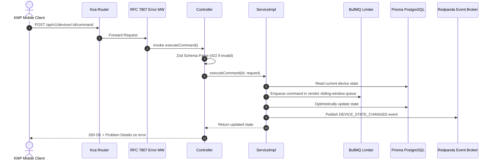

# 🏛️ Clean Architecture & Domains

The ABS Smart Home Backend is structured around strict **Domain Boundaries** (`src/domains/`) to guarantee isolation, maintainability, and testability.

## 📂 Domain Folder Anatomy

Each domain in `src/domains/<domain>` contains:

```
src/domains/<domain>/
├── schemas.ts         # Zod schemas & OpenAPI 3.1 registry bindings
├── routes.ts          # Koa router factory consuming injected controller
├── controller.ts      # Pure HTTP parsing and status mapping
├── service.ts         # Domain interface + ServiceImpl business logic
├── service.spec.ts    # Co-located unit test suite
└── adapters/          # (Optional) Third-party IoT vendor adapters
```

---

## 🔄 Request Lifecycle Flow


