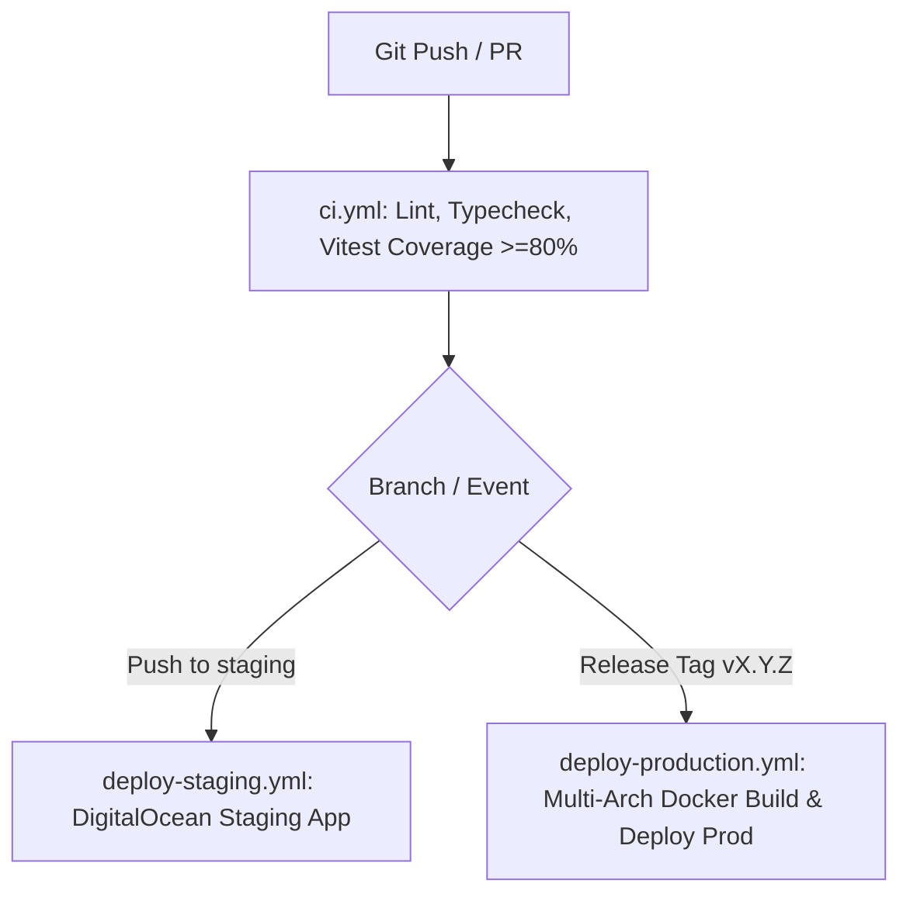

# 🚀 CI/CD & Automated Deployments

ABS Smart Home Backend uses **GitHub Actions** for automated linting, typechecking, 80%+ test coverage gates, container packaging, and continuous deployment.

---

## 🔄 Pipeline Workflows



---

## 📋 Quality Gate Checklist

Every pull request or release tag executes:
1. **Formatting & Linting**: `npm run lint` (ESLint 9 Flat config, 4-space indentation)
2. **Type Checking**: `npm run typecheck` (`tsc --noEmit` under TypeScript strict mode)
3. **Vitest Coverage Gate**: `npm run test:coverage` (enforces $\ge 80\%$ line and branch coverage)
4. **OpenAPI Sync**: `npm run spec:export` (ensures `docs/openapi.json` matches Zod schemas)
5. **Docker Build**: `docker build -t abs-backend .` (verifies multi-stage build cleanly compiles)

---

## 🏷️ Release Protocol

1. Bump version in `package.json`.
2. Export OpenAPI spec (`npm run spec:export`).
3. Commit and push to `main`.
4. Tag release:
   ```bash
   git tag -a v1.1.0 -m "Release v1.1.0"
   git push origin v1.1.0
   ```
5. Create GitHub Release via `gh release create v1.1.0`.
