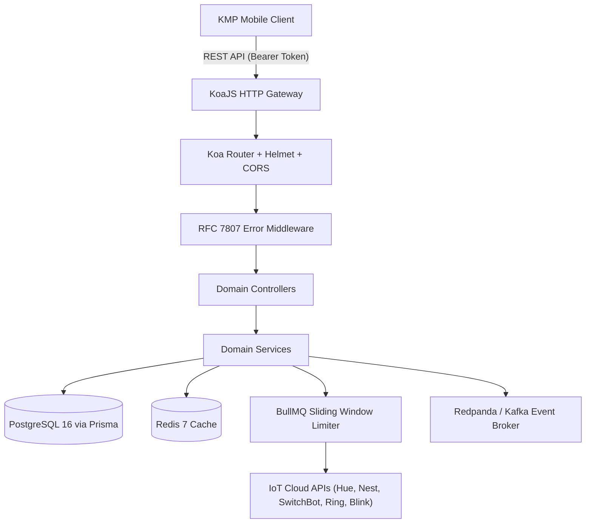

# 🌟 ABS Smart Home Backend Overview

Welcome to the technical documentation for the **ABS Smart Home Backend** (`abs-home-backend`).

The ABS Smart Home Backend is a high-performance **KoaJS + TypeScript** IoT gateway and domain control plane built to unify smart devices, power telemetry, and custom automation routines across diverse IoT vendor ecosystems.

---

## 🎯 Supported IoT Ecosystems

| Vendor | Integration Method | Supported Capabilities |
| :--- | :--- | :--- |
| **Philips Hue** | CLIP v2 / REST Local Bridge | Lights, Brightness, Color Temperature, RGB, Scenes |
| **Google Nest** | Smart Device Management (SDM) API | Thermostats, Eco Mode, Target Temp, HVAC Status |
| **SwitchBot** | Open API v1.1 (HMAC-SHA256 Auth) | Curtains, Bots, Plugs, Meters |
| **Ring** | Ring Doorbell & Camera API | Video Doorbells, Motion Sensors, Live Stream, Sirens |
| **Amazon Blink** | Blink Home Monitor REST API | Cameras, Arm/Disarm, Thumbnails, RTSP Liveview |
| **Three-Phase Meter** | Shelly 3EM / Energy Ingestion | Real-time Power (Phase A, B, C), Voltage, Current, kWh |

---

## 🏛️ High-Level Architecture Diagram

---

## 🧭 Navigation Guide

- **[Getting Started](/docs/getting-started/overview)**: Prerequisites, local setup, and Docker Compose stack.
- **[Architecture](/docs/architecture/clean-domains)**: Clean Architecture, Dependency Injection container, and resilience patterns.
- **[Domain Services](/docs/domains/devices-and-adapters)**: Deep dive into devices, automations, three-phase energy, and security.
- **[Swagger UI & OpenAPI](/docs/api/swagger-ui)**: Interactive REST API documentation and OpenAPI 3.1 specification.
- **[Infrastructure & Deployment](/docs/infrastructure/terraform)**: DigitalOcean App Platform and Terraform IaC.
